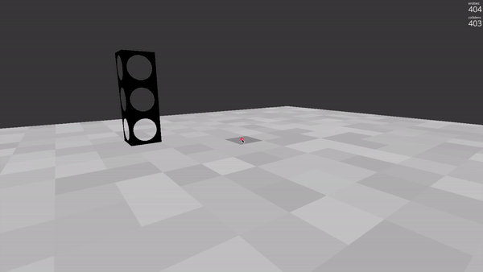

# Inchworm Simulation (Ursina Engine)
An advanced simulation showcasing inchworm behavior in a Minecraft-like environment, utilizing Python and the Ursina Engine. This project goes beyond the basic game mechanics to allow for the automated construction of structures through the manipulation of blocks by simulated inchworm movements.

# Requirments 
This simulation was developed using Python 3. Python 3.12 is strongly recommened. Using lower version of Pyhton can cause signifcant bugs.  For more information visit: https://www.python.org/downloads/release/python-3120/ 

Required packages: 
1. ursina 
2. numpy 

# How to Download and Run ⬇
1. Make sure you have Python installed and Ursina too. If you have Python, go to the Command Line and type `pip install ursina`.
2. Download this Repository (or clone it).
3. Extract the ZIP file (not required it's cloned) and run the `sim.py` file.

### How to edit the simulation ?
congif.py file includes the location of Block Depot, initial position and orientation of the inchworm's leading leg. There is an additional parameter called DEMO. If True, the simulation will simplfy the steps to build the desired structure. This should only be true when building a 3-block column.

## Controls ⌨
| Key | Description |
| :---: | :---: |
| `WASD` | Movement |
| `Mouse` | Camera Rotation |
| `Space` | Jump |
| `Left Click` | Place Block |
| `Right Click` | Remove Block |
| `L` | Identify known substructures |
| `N` | Move the inchworm to next block |
| `P` | Calculate entire path and steps for inchworm to build given structure. Spawn Block Depot and leading inchworm foot. Write steps to steps.txt |
| `G` | Generate pyramid structure |
| `F` | Enable flying and different camera angles |
| `QE` | Fly up/down |
| `1234` | Switch cameras |

## Demo usage 
1. Build any structure you want to display in the workspace. 
2. Identify known substructures (`L`), if there is a known structure it will change the color of the substructure
3. Calculate path a for inchworm (`P`) and spawn the Block Depot and inchworm foot. It will create or overwrite the steps.txt with the current list of steps.
4. Press `N` and watch the inchworm move to the next block!

Note: You must press `L` then `P` (only once) for the simulation to work as intended.
Note: If you walk off the edge of the field you will fall and will need to either fly to get back up or restart the simulation
Note: Each green surface represents each leg of the inchworm
Note: Run press_n.py to automate pressing n. You must give permission to the environment that you are running on to allow keyboard press. 

# About ℹ
This is based on Ursina gaming engine for more information please visit: https://github.com/SpyderGamer/Minecraft-with-Python/releases